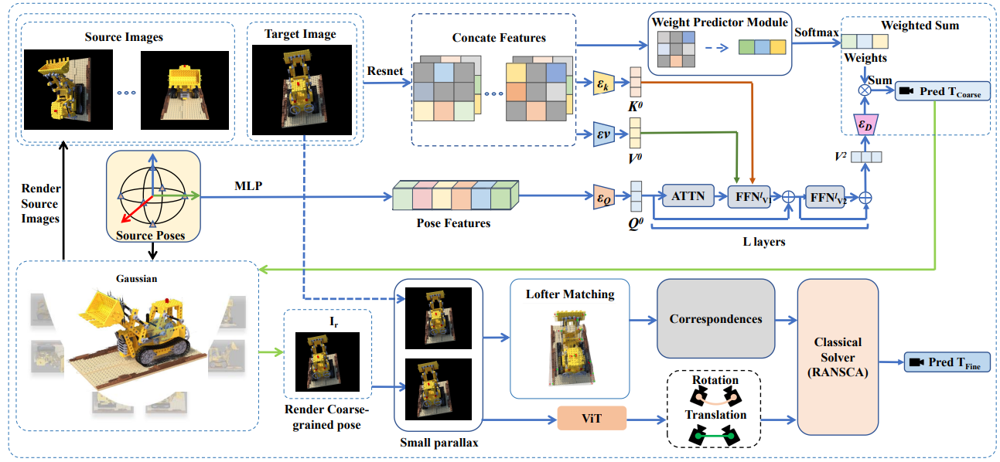

# [IROS 2025] iGaussian

### [Paper](https://arxiv.org/abs/) 
<br/>

> iGaussian: Real-Time Camera Pose Estimation via Feed-Forward 3D Gaussian Splatting Inversion
> 
> Hao Wang*, [Linqing Zhao*](https://lqzhao.github.io/), [Xiuwei Xu](https://xuxw98.github.io/), [Jiwen Lu](http://ivg.au.tsinghua.edu.cn/Jiwen_Lu/), [Haibin Yan](https://scholar.google.com/citations?user=-AQLKlsAAAAJ&hl=zh-CN&oi=ao)  


## Project Introduction

iGaussian is an innovative real-time camera pose estimation framework that leverages feed-forward 3D Gaussian splatting inversion to estimate 6DoF camera poses from a single RGB image, achieving both high accuracy and efficiency. Unlike traditional optimization-based methods, iGaussian eliminates iterative loops, enabling fast and robust pose estimation even under extreme viewpoint changes.

**Key Features:**
- ⚡ **Real-Time Performance:** Achieves 2.87 FPS on mobile robots, with over 10× speedup compared to optimization-based methods.
- 🎯 **High Accuracy:** Median rotation error as low as 0.2°, robust under large viewpoint changes (±[80°, 180°]).
- 🔧 **No Depth Required:** Works with RGB images only; no depth sensor needed.
- 🏗️ **Two-Stage Pipeline:**
  - Stage 1: Coarse pose estimation via spherical sampling and attention-based multi-view fusion.
  - Stage 2: Pose refinement using LoFTR feature matching and RANSAC-based geometric optimization.
- 💡 **Hybrid Design:** Combines learning-based and geometric constraints for robust, end-to-end pose estimation.

**Applications:**
- 🤖 Robot navigation and SLAM
- 🥽 Augmented/Virtual Reality (AR/VR)
- 🎮 Visual odometry, 3D reconstruction, and novel view synthesis

<p align='center'>

</p>

# Feed-forward iGaussian 

## Overview

This project implements a camera pose estimation pipeline based on Gaussian rendering and deep learning. It provides end-to-end scripts for both training and evaluation.

- **Training entry point:** `tools/train_blender.py`
- **Evaluation entry point:** `tools/matching.py`

## Directory Structure

- `tools/` — Main scripts for training, evaluation, and configuration
- `models/`, `utils/`, `loader/` — Model definitions, utility functions, and data loaders
- `gaussian/`, `rendering/` — Gaussian rendering and related modules
- `LoFTR/` — Feature matching submodule (all dependencies included in the environment)
- `submodules/` — CUDA-accelerated dependencies (must be built manually)

## Environment Setup

It is recommended to use the provided `environment.yaml` file to create a conda environment with all required dependencies:

```bash
conda env create -f environment.yaml
conda activate icomma
```

All required Python packages, including those for LoFTR-based feature matching, are already included in the environment.

## CUDA Extensions

Some modules require CUDA extensions (e.g., `simple-knn`, `icomma-diff-gaussian-rasterization`). Build them as follows:

```bash
cd submodules/simple-knn
python setup.py install

cd ../icomma-diff-gaussian-rasterization
python setup.py install
```

Make sure your system has a compatible CUDA toolkit and PyTorch version installed.

## Prepare data and train the 3DGS model.

We evaluated our method using the Blender, LLFF, and 360° Scene datasets provided by NeRF and Mip-NeRF 360. You can download them from their respective project pages.

Alternatively, you can build your own Colmap-type dataset following the guidelines of 3D Gaussian Splatting.

After obtaining the <source path>, train the 3DGS model according to the tutorial of 3D Gaussian Splatting. It should have the following directory structure:

```bash
├── <model path> 
│   ├── point_cloud   
│   ├── cameras.json
│   ├── cfg_args
│   ├── input.ply
```

## Other Requirements

- Linux OS is recommended, with NVIDIA GPU support.
- Prepare your training and testing datasets. Paths are configured in `tools/config_blender.py`.

## Configuration

The main configuration file is `tools/config_blender.py`, which specifies dataset paths, model parameters, and training settings. Edit this file to customize your data locations or model structure.

## Training Usage

1. Edit `tools/config_blender.py` to set correct dataset paths and parameters.
2. Start training:

```bash
python tools/train_blender.py
```

Model checkpoints will be saved automatically to the specified directory.

## Evaluation Usage

1. Ensure `model_path` and `config_file` in `tools/matching.py` are set correctly.
2. Run the evaluation script:

```bash
python tools/matching.py
```

The script will load the trained model, perform camera pose estimation, and print error metrics.

## Troubleshooting

- **Dependency installation issues:** Ensure CUDA, PyTorch, and other requirements are properly set up. Refer to submodule READMEs if needed.
- **Dataset path errors:** Update paths in `config_blender.py` to match your data locations.
- **Out of memory:** Reduce batch size or use a smaller model if you encounter GPU memory issues.

## Acknowledgements

This project uses [LoFTR](https://github.com/zju3dv/LoFTR) for feature matching. Thanks to the original authors for their open-source contributions.

---

For more details or specific questions, please refer to the code comments or open an issue. 
